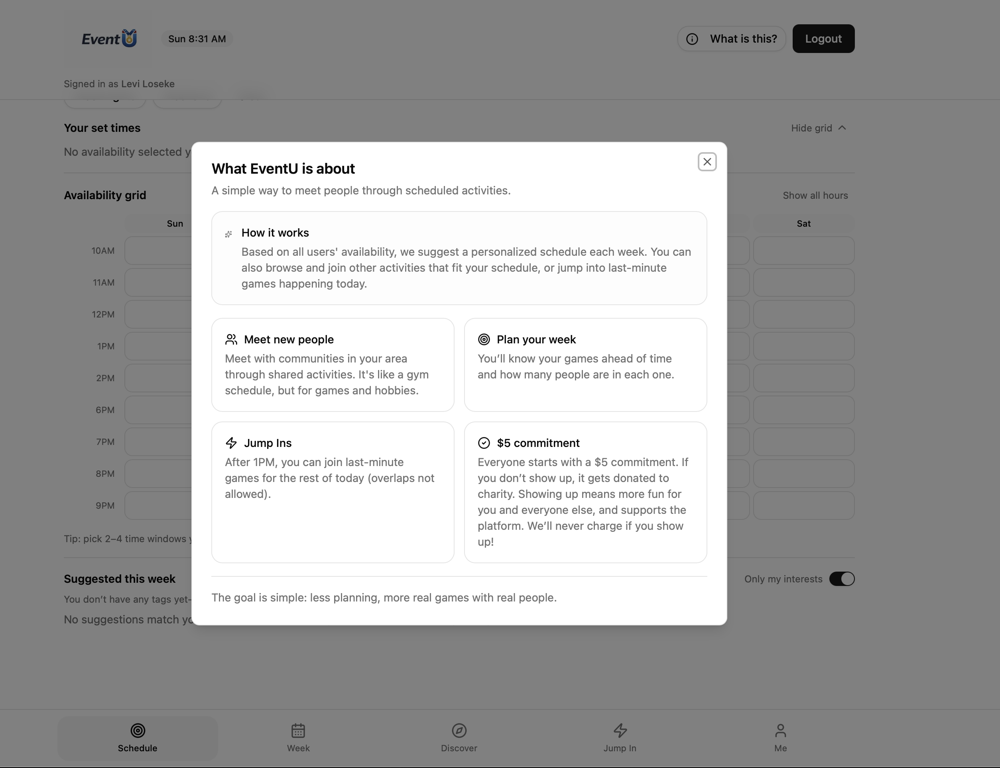

This is a [Next.js](https://nextjs.org) project bootstrapped with [`create-next-app`](https://nextjs.org/docs/app/api-reference/cli/create-next-app).

## Getting Started

First, run the development server:

```bash
npm run dev
# or
yarn dev
# or
pnpm dev
# or
bun dev
```

Open [http://localhost:3000](http://localhost:3000) with your browser to see the result.

You can start editing the page by modifying `app/page.tsx`. The page auto-updates as you edit the file.

This project uses [`next/font`](https://nextjs.org/docs/app/building-your-application/optimizing/fonts) to automatically optimize and load [Geist](https://vercel.com/font), a new font family for Vercel.

### Authentication setup

The dashboard is protected by Auth0.  You'll need to configure a tenant
and supply credentials via environment variables before you can log in and
register for events.

1. Create a free account at https://auth0.com and add a **Regular Web
	Application**.
2. In the application settings, set the following URLs:
	* **Allowed Callback URLs**: `http://localhost:3000/api/auth/callback`
	* **Allowed Logout URLs**: `http://localhost:3000`
	* **Allowed Web Origins**: `http://localhost:3000`
3. Copy the **Domain**, **Client ID**, and **Client Secret** from the
	application settings.
4. Generate a long random string for `AUTH0_SECRET` (e.g. `openssl rand -hex 32`).
5. Create a `.env.local` file in the project root with the following
	values (replace placeholders with your real values):

```env
AUTH0_SECRET="<your-secret>"
AUTH0_BASE_URL="http://localhost:3000"
AUTH0_ISSUER_BASE_URL="https://<your-tenant>.us.auth0.com"
AUTH0_CLIENT_ID="<your-client-id>"
AUTH0_CLIENT_SECRET="<your-client-secret>"
```

6. Restart `npm run dev`; the login page will now redirect through Auth0.

Once authenticated you can access `/dashboard`, register for events, and
see your profile in the UI.

The auth routes are implemented under `app/api/auth/[...auth0]/route.ts`.
## Learn More

To learn more about Next.js, take a look at the following resources:

- [Next.js Documentation](https://nextjs.org/docs) - learn about Next.js features and API.
- [Learn Next.js](https://nextjs.org/learn) - an interactive Next.js tutorial.

You can check out [the Next.js GitHub repository](https://github.com/vercel/next.js) - your feedback and contributions are welcome!

## Deploy on Vercel

The easiest way to deploy your Next.js app is to use the [Vercel Platform](https://vercel.com/new?utm_medium=default-template&filter=next.js&utm_source=create-next-app&utm_campaign=create-next-app-readme) from the creators of Next.js.

Check out our [Next.js deployment documentation](https://nextjs.org/docs/app/building-your-application/deploying) for more details.

# Docker Info

```cmd
docker build -t eventu .
```

```cmd
docker run -p 3000:3000 --env-file .env.local eventu

```


